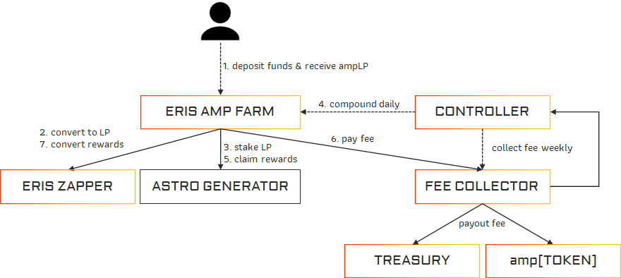

# Amp Compounder

Autocompound your LP token rewards from providing liquidity to dexes like Astroport.
You will receive amp[LP] tokens that are still moveable or useable in other products like the AMP Extractor.

- Terra: <https://www.erisprotocol.com/#/terra/amp-compounder>

## Process

:::white

:::

:::black

:::

### User

1. User deposits funds into the Amp Compounder Farm. For each pool with incentives there is a farm contract and a farm specific ampLP token.
2. The Eris Amp Farm converts the deposited assets to the wanted LP token by using the Eris Zapper
3. Afterwards it stakes the LP in the Astro generator to receive astro rewards or dual incentives

### Controller

4. We autocompound the rewards daily using a controller bot. 
5. It will claim all rewards into the Amp Farm.
6. On these rewards Eris Protocol takes a reward fee, that is payed to the Fee collector.
7. The rest of the rewards is converted again using Eris Zapper to the LP and restaked into the Astro Generator. That means each day the conversion rate between ampLP to LP increases, as with each compound the managed LP increases, while no new ampLP are being distributed.

Weekly we convert the collected fees to Luna / [TOKEN] and pay it out to the Treasury and ampLUNA / amp[TOKEN] holders.

## Deposit

You can deposit into the Amp Compounder using the following options.

### Zap

Allows you to deposit into the Amp Compounder pools with any token we support.
We will automatically convert your token to the destination LP weight, so you do not need to calculate how much you need to swap.

If a swap is happening, we will show the swap path your funds take. Keep in mind, that we might not choose the best route, but use the main DEX of the ecosystem for the swap.

### Tokens

Allows you to deposit into the pool using the tokens from the pool you want to deposit in.
By default we keep the ratio like the pool, so no swap is being executed.
If you want to deposit in a single asset, remove the check of "Keep 50:50 ratio". Then a swap is being executed when needed.

### LP
If you already have an Astroport LP in your wallet, you can use the LP option to directly deposit that LP into the ampLP.

### Staked
By default when you provide funds to an Astroport Pool you will not receive incentives and are only eligable if you also stake your LP tokens with the Astro Generator. If you have an Astroport LP that is staked, you can directly withdraw and deposit it into Eris Amp Compounder by using this option.

## APY calculation

We are using the data from [Astroports APY calculation](https://docs.astroport.fi/astroport/backend/apy-calculation) and
compound the pools daily.

Based on their value of APR we convert it to APY using the following formula.

$\displaystyle Amplified\ APY = \left(\frac{1 + (Astroport\ Yearly\ APR * (1 - Eris\ Reward\ Fee))}{365} \right)^ {365} -1$

## Advantages of using Eris Amp Compounder

When using the Amp Compounder you will receive an ampLP token as your share of the pool. This has some benefits:

- possibility to use ampLP as collateral for stablecoins or lending
- possibility to use ampLP in the Amp Extractor
- transfer ampLP between wallets

This also makes usage of auto compounding super tax efficient in some jurisdictions. You do not directly receive rewards into your wallet, but instead when you enter a pool you "swap" into the ampLP token and then your ampLP token grows in value by accumulating more LP tokens underneath. When you exit the pool you will later swap your ampLP token against more assets than you initially deposited.

Allows you to deposit / zap directly into the pool using any supported single asset. E.g. you can enter the VKR-axlUSDC pool by providing LUNA and the rest is being calculated / swapped by the Eris Zapper.

We do not extract any value using a governance token, but instead allow holders of amp[TOKEN] directly participate in the reward fee we generate.

## Disadvantages

Even with our high focus on security and best practices, mistakes can happen and there are always risks involved

## Fees

Instead of extracting value through a Eris Platform token, we will directly let amp[TOKEN] holders participate in rewards and increase their auto-compounding value.

- Deposit Fees: 0 %
- Performance Fees
  - 2.5 % to amp[TOKEN] holders 
  - 2.5 % Protocol Treasury
- Withdrawal Fee: 0 %
