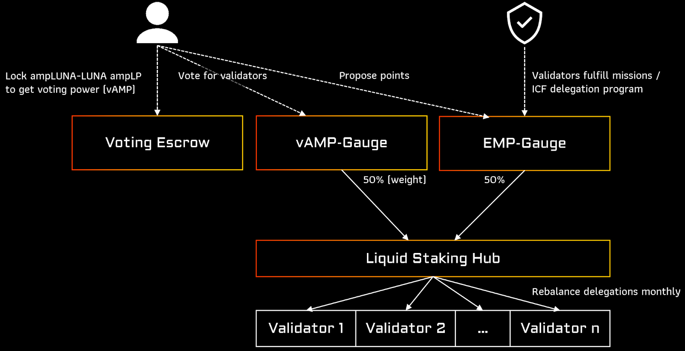

# Amp Governance

Amp Governance allows the protocol users to decide on how the protocol delegates funds and participates in chain governance votes. We want to provide a framework for a fair, decentralized delegation and governance structure.

Decentralize the approach on how we delegate protocol funds to validators and help locking liquidity in astroport to provide a stable market for lending and collateral protocols. Delegations will be calculated by a configurable set of on-chain rules. Adding new validators to join the ERIS Protocol Whitelist will still go through our centralized application process to verify hosting, team quality, community and setup monitoring. We want to allow a diversified set of validators without us interfering or controlling delegations. But we do want to incentivize in our opinion good behavior that often happens off-chain and will need some central committee or decision process.

There are different mechanisms for how LSD’s currently select their validators or delegation amount.

1. **Giving power to own token**: Some protocols use their own LSD governance token to decide delegations. This de-facto allows the protocol contributors, advisors and strategic partners often to own more than 50 % of the voting power. For us this means a major risk for all chains involved, as external parties will have delegation and voting power over a different network. The bigger a protocol will grow, the bigger are the risks, as the LSD governance token will take these rights from the user.

2. **Using friendly or own validators**: Other protocols, while communicating decentralization, are selecting friendly validators or even delegate to their own validators. Many of these deals happen behind closed doors and the process is intransparent.

3. **Allow user to decide once**: Others allow users to decide once during the staking process to select the validator (from a curated list). This looks good on paper, but as soon as you add the possibility to trade the LSD, you cannot change that delegation anymore.

This is why we went back to the drawing board on how our governance process should look like.

We decided to implement a 2-gauges principle that can be weighted with configuration.

:::white

:::

:::black

:::

## vAMP-Gauge - Vote Escrowed ampLP

The first gauge is our “Vote Escrowed amp[TOKEN]-[TOKEN] ampLP gauge” or short vAMP-gauge. Instead of using a governance token or only LSD locking mechanism, we allow users and validators to lock in auto-compounding LP liquidity (ampLP).

The user can decide on how long he wants to lock his funds and can choose between any time between 3 weeks minimum lock time and 2 years maximum lock time. When locking liquidity for 3 weeks the user receives ~1.3x voting power (1+(9\*3/104)) while when locking his funds for 2 years receives 10x (1+(9\*2\*52/104)).

The user then can vote on up to 3 validators with his voting power. The same voting power will later be used to vote on governance proposals.

### Benefit for LSD stability

By incentivizing locking and increasing voting power by lock time, we want to provide a deeper liquidity to our amp[TOKEN]-[TOKEN] pools and make liquidity more predictable due to lock times.

This also gives back the delegation power of the protocol funds back to the user, as each user can participate and vote on the protocol delegations.

## EMP - ERIS Merit Points

***Note: The name EMP is not yet decided on. Also to make the protocol more automated, the EMP-gauge is optional***

The second one is our ERIS Merit Points gauge - short EMP-gauge.

EMPs are a way to reward our whitelisted validators that participate and help us or the cosmos community. They will be tracked on-chain and there are 2 different kinds of points. Decaying and fixed. Continued support operations like running relaying will earn fixed points, while one time missions will reward decaying points.

We are in progress of creating an extensive EMP catalog with standard missions and operations to boost the validators EMP power and define how they can increase their delegations. We update the community monthly on the points that we give out.
We have three ways of rewarding EMPs to Validators.

1. **Monthly validator missions**: We want our whitelisted validators participate in our protocol and the community growth and are handing-out a monthly mission board to them. This is also about educational content or user activation for creating a flourishing DeFi ecosystem.

2. **Community Representatives**: We also want the community to be involved in the delegation mechanism. This is why we will be nominating 5 community members, of which each can nominate 3 EMPs per month. We will check conflict of interest on submitted coins and also allow any proposal from community members. We do not want to create overhead for key community members but instead they should be able to vote based on their own preference on what they saw over the past month and what they think should be rewarded.

3. **EMP catalog / ICF delegation program**: We are not planning on reinventing the wheel on how good community validators should behave, but we will take the rules based on the ICF delegation program and apply points to them. If a validator fulfills rules, he will be rewarded by extra delegations. This will be tracked in a visible EMP catalog for reference where we will also add custom community specific tasks a validator can participate in. For example tasks like running relayers will reward permanent points while providing the service.

### Benefit for LSD stability

By providing incentives to participate in the chain we want to increase the validators' engagement with the community. Having involved validators’ leads to a healthy system and governance.

## Delegations

Each first Monday of every month we apply rewarded EMPs and tune both gauges, automatically apply the result to the delegation distribution and redelegate the protocol funds to the top x chosen validators.

There are some safety features available, so validators will only be able to receive up to x % of the total delegations, require a min delegation % to become active and need to be verified and whitelisted.

Initially the weighting will be closely watched and we will start with an even weighting between vAMP and EMP: 0.5 * EMP gauge + 0.5 * vAMP gauge = delegation percentage.