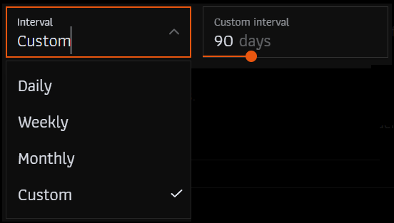
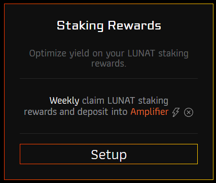
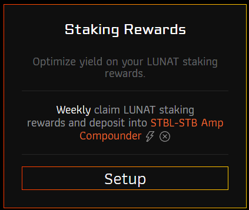
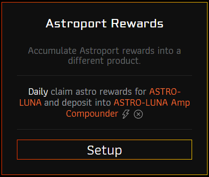
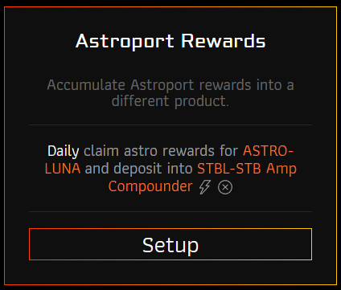

# Amp Z

AMP Z will be an in-wallet DeFi automation product, that will automate daily / weekly tasks.

## Accessing Liquidity

On Terra a big part of available funds are being vested or only accessed through claiming staking rewards. Amp Z is a way to yield-optimize unused potential, by automating in-wallet transactions using the authz cosmos module.

## Setup

Amp Z can automate claiming yield from defined sources and depositing them to defined DeFi destinations.

### Yield sources

- **Staking rewards**: Use your staking rewards from your vesting tokens.
- **Astroport rewards**: Use your LP incentives to yield-optimize.
- **Wallet funds**: Auto deposit or DCA wallet funds in DeFi products:
  - This allows automations like start unbonding vested tokens and auto deposit them into DeFi.
  - Act as a savings account, auto transfer any balance above a certain threshhold.
  - DCA your wallet funds into DeFi destinations, as you can set the max amount to be used.

If you want more yield sources available, let us know in our TG.

### Yield destinations

- **Amplifier**: Deposit into a liquid staking derivative. After the execution your wallet will have more ampLUNA.
- **Compounder**: Deposit into yield optimized and daily compounded astroport pools. After the execution your wallet will have more ampLP available.
- **Token**: Swap your yield into a specific (supported) token. After the execution your wallet will have more of the token available.

If you want more destinations available, let us know in our TG.

### Schedule

You can define an interval on how often you want to execute your automation. Keep in mind, that operators will only execute your automation if their reward fee is higher than the gas prices they pay. So a daily schedule will probably not be executed if the compounded amount is too small.

You can always manually execute an automation outside of the normal schedule.

## Example Strategies

### Luna Degen

Claim your vesting LUNA staking rewards and auto-compound it into the ERIS LSD ampLUNA.

### Luna Extractor

Claim your vesting LUNA staking rewards and cash them out into stable coins.

### Astro Farmer

Claim all your astro rewards daily and auto-compound them into ASTRO-LUNA or ASTRO-USDC pools to immediately take advantage of compounding intrest.

### Astro Extractor

Claim your astro rewards and cash them out into stable coins or other coins you believe in.

## Danger! MUST READ

All ERIS products are experimental technologies.

By giving a grant to our smart contract, the smart contract can execute any smart contract interaction. The authz module is very permissive what transactions are allowed to be executed, to make the transactions we execute more secure and transparent, we have decided to only give wallet access to an auditable, hard coded smart contract. This allows you to verify what kind of actions we execute on your wallet and will never give the operators any direct access to your wallet. Only your defined actions will be executed.

## Fee

The fees are calculated based on the value that is being compounded from the source.

- Deposit Fees: 0 %
- Operator Fee: 1 %
- Protocol Fee
  - 1 % to amp[TOKEN] holders
  - 1 % Protocol Treasury
- Withdrawal Fee: 0 %
