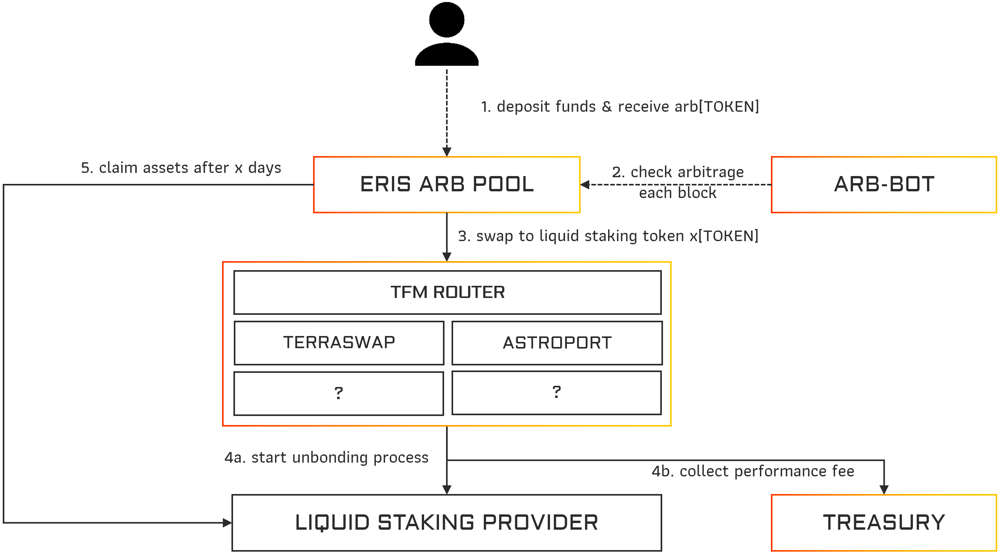
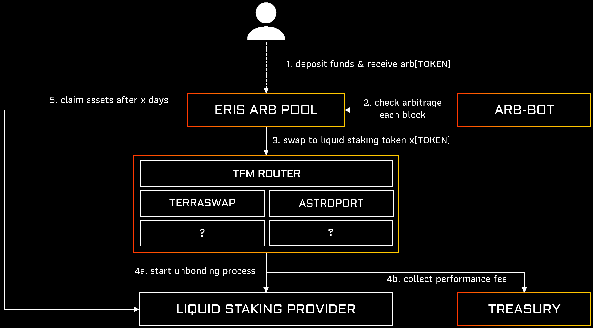

# Arb Repeater

## Sneak Peak 

Deposit your [TOKEN] in our Eris ARB pool and connect all different liquid staking arbitrage possibilities.

When a user wants to have immediate access to the underlying [TOKEN] of amp[TOKEN] they will need to use a dex to swap it directly.
While unbonding and waiting for 21-24 days is always free, direct availability through swapping usually costs around 1-2% premium.

This is where ERIS Protocol will come into play and use this arbitrage opportunity of 1-2% every 21-24 days to increase the pool value while having full exposure to the underlying token and aggregating rewards in the same apex token.

## Process

:::white

:::

:::black

:::

## Fees

Instead of extracting value through a Eris Platform token, we will directly let amp[TOKEN] holders participate in rewards and increase their auto-compounding value.

As arbitrage trading requires more complex bots and optimization techniques that are manually not reproduceable the fees are higher than the other Eris products but still very competitive. Similiar to the [Amp Compounder](./../amp-compounder/), the amp[TOKEN] holders will receive the same ratio of the performance fees.

- Deposit Fees: 0 %
- Performance Fees
  - 2 % to amp[TOKEN] holders 
  - 8 % Protocol Treasury
- Withdrawal Fee: 0 %
