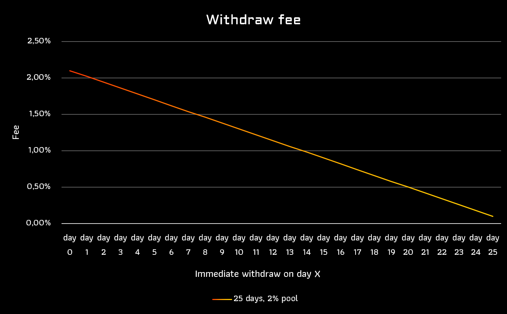

# Arb Vault

## Sneak Peak

Deposit your [TOKEN] in our Eris ARB pool and connect all different liquid staking arbitrage possibilities.

When a user wants to have immediate access to the underlying [TOKEN] of amp[TOKEN] they will need to use a dex to swap it directly.
While unbonding and waiting for 21-24 days is always free, direct availability through swapping usually costs around 1-2% premium.

This is where Eris Protocol will come into play and use this arbitrage opportunity of 1-2% every 21-24 days to increase the pool value while having full exposure to the underlying token and aggregating rewards in the same apex token.

## Liquidity States

ERIS Pools will hold the liquidity for the arbitrage execution and make sure only profitable arbitrages are executed.
The liquidity inside a ERIS pool has multiple states:

- **Available Assets** - The main asset that is available for arbitrage opportunities. They can be seen in the contract.
- **Locked Assets** - Assets that are scheduled for withdrawl by users, we also have a unbonding period. To withdraw liquidity from the pool see [Withdrawing Liquidity](#withdrawing-liquidity).
- **Unbonding Assets** - Assets that are currently unbonding at the liquid staking provider - we will provide links in the dApp to provide full on-chain transparency of funds.
- **Withdrawable Assets** - Assets that can be withdrawn from the liquid staking provider back into the ERIS pool

## Process

### Execution Flow

:::white

:::

:::black

:::

#### Static execution

Initially the asset pools will have a static execution model. For each aribtrage opportunity a specific utilization of the pool is allowed.

[arb opportunity, assets from pool that can be used]

- arb[TOKEN]: [0.5%, 10%] [1%, 40%], [1.5%, 70%], [2.0%,100%]

##### Example

| Trades    | **Pool utilization** | **Arb opportunity** | **Max funds used** | **New utilization** { class="compact" } |
| :-------- | -------------------: | ------------------: | -----------------: | --------------------------------------- |
| **Arb 1** |                   0% |                0.5% |                10% | 10%                                     |
| **Arb 2** |                  10% |                1.5% |                60% | 70%                                     |

#### Dynamic execution

After the launch a dynamic execution model will be created, so the funds are used in a more efficient way.

1. The arbitrage opportunity always has to be higher than the staking APR.
2. The arbitrage opportunity always must be higher than 0.5 %
3. The goal is to have 3/4 of the pool always unbonding, so that most of the capital is working, but a buffer is available for additional higher arbitrage / immediate withdrawls.
4. We use market statistics to calculate the amount of funds that should be used at which arbitrage opportunity.

##### Possible indicators

1. EMA (Exponential moving average)
2. Peak
3. Liquidation risks
4. Asset volatility

### Withdrawing Liquidity

As the assets inside the ERIS pool can have multiple different states - explained in [Liquidity States](#liquidity-states) - liquidity providers cannot directly withdraw funds, as they might be unbonding at the moment.

This is why withdrawing liquidity from ERIS will take longer than the unstaking period of the liquid staking providers. For LUNA we will initially set the parameter to 25 days. After the 25 days the funds can be claimed / withdrawn by the user.

If the pool has available funds in the original asset (not unbonding), we provide the possibility to immediately withdraw funds for a fee.

So when you want to withdraw funds immediately from the pool without waiting for the unbonding period (25 days for LUNA) and funds are available you will have to pay a 2 % fee to the pool and 0,1 % to the protocol. The same will be applied linearly if you want to instantly withdraw funds currently unbonding.

Unbonding liquidity will not earn intrest for you.

:::white

:::

:::black

:::

## Performance model

The great thing about ERIS is, that the APY is not generated by a minted token or incentives, but only through swaps and market inefficiencies at the right time.

Before the Terra crash there are regular arbitrage opportunities around 1-2% every 21-25 days which would lead to an APY of 18.9-33.5 %. On the other hand xprism is sometimes even trading at 5% markup.

The APY can't be calculated in advance as it depends on the market conditions and how often funds sit idle while waiting for an opportunity.

:::white

:::

:::black

:::

### APY Calculation

| **Opportunity** | **40 days** | **35 days** | **30 days** | **25 days** | **21 days** { class="compact" } |
| --------------: | ----------: | ----------: | ----------: | ----------: | ------------------------------: |
|        **0,5%** |        4,7% |        5,3% |        6,3% |        7,6% |                            9,1% |
|        **1,0%** |        9,5% |       10,9% |       12,9% |       15,6% |                           18,9% |
|        **1,5%** |       14,6% |       16,8% |       19,9% |       24,3% |                           29,5% |
|        **2,0%** |       19,8% |       22,9% |       27,2% |       33,5% |                           41,1% |
|        **2,5%** |       25,3% |       29,4% |       35,0% |       43,4% |                           53,6% |
|        **3,0%** |       31,0% |       36,1% |       43,3% |       54,0% |                           67,2% |
|        **3,5%** |       36,9% |       43,2% |       52,0% |       65,2% |                           81,8% |
|        **4,0%** |       43,0% |       50,5% |       61,2% |       77,3% |                           97,7% |
|        **4,5%** |       49,4% |       58,3% |       70,8% |       90,2% |                          114,9% |
|        **5,0%** |       56,1% |       66,3% |       81,1% |      103,9% |                          133,5% |

## Why use ERIS

Currently a lot of manual arbitrage opportunities exist, that can be tracked / notified through tools like e.g. the telegram bot arbie, but often you will not catch the opportunity or miss it. That is why ERIS will automate the process for you.

**Speed** - The manual way is always slower than using a bot or defi protocol automating it. As soon as ERIS launches arbitrage possibilities will be reduced as the protocol will manage it and keep the peg between the token and the liquid staking token.

**Time** - You will not have to worry about missing any opportunities anymore, no matter what you do, where you are or if you sleep. ERIS will always check and execute arbitrage opportunities.

**Fairness** - Each opportunity will be shared by the whole pool. That means not the fastest one will receive the reward, but the profit will be shared by the whole pool.

**Liquidity** - We provide Liquidity for liquid staking tokens, so that liquid staking token holders can swap through ERIS pools to get a fixed swap rate.

**Tax efficiency** - In many countries a token swap will lead to taxable events. Using ERIS protocol, you will only swap once into the eLUNA-LP token e.g. and this token will increase in value. And when you want to stop using ERIS you can claim more LUNA than you originally invested. When doing it manually you will create taxable events every time you use the arbitrage.

## Fees

Instead of extracting value through a Eris Platform token, we will directly let amp[TOKEN] holders participate in rewards and increase their auto-compounding value.

As arbitrage trading requires more complex bots and optimization techniques that are manually not reproduceable the fees are higher than the other Eris products but still very competitive. Similiar to the [Amp Compounder](./../amp-compounder/), the amp[TOKEN] holders will receive the same ratio of the performance fees.

- Deposit Fees: 0 %
- Performance Fees
  - 2 % to amp[TOKEN] holders
  - 8 % Protocol Treasury
- Withdrawal Fee: 0 %
