# Alliance Liquidity Hub

The Alliance Liquidity Hub is the central place for Terra based liquidity incentives. It converts staking rewards to incentives used for liquidity providers and voters to create a positive liquidity feedback loop.

## User Mechanics

The mechanics of the Alliance Liquidity Hub is similar to existing ve(3,3) model. Instead of directly using token emissions, instead, chain staking rewards are distributed to liquidity providers. In return the Community Pool is acquiring liquidity position assets for building up a permanent chain owned liquidity. This is essential for building a lasting economy with deep liquidity in the ecosystem.

The following graphic shows participants and stakeholders of the Alliance Liquidity Hub.

:::{.img-link .height-600}
[!ref target="blank" text="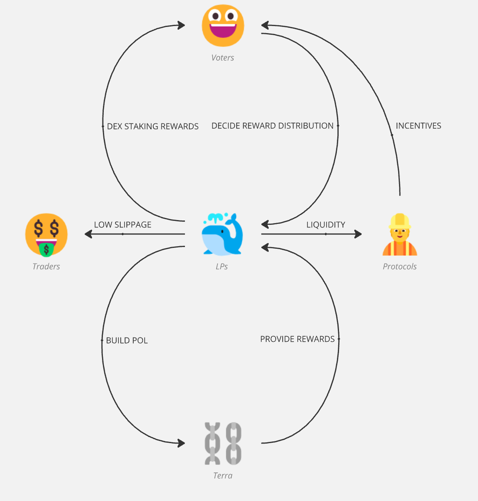"](image-2.png)
:::

### 1. Voters

Voters lock up LUNA, ampLUNA or bLUNA to create NFT-based locks. These locks will receive a voting power based on the lock time. A full 2 year lock will receive 10x the amount of voting power compared to a 1 week lock. Voting Power always counts the underlying amount of LUNA as fixed base amount. For LUNA it is equal to the lock amount, for LSTs it is lock amount \* LST redemption rate, so it is beneficial to use LSTs as lock token.

Voters can decide how liquidity rewards are being distributed to LP assets. This happens through gauge voting.

Voters will receive rebases based on the amount of underlying assets they staked and Voting incentives based on incentives provided by projects or by bribe recapture.

### 2. Liquidity Providers

Liquidity Providers bring in liquidity, and receive LP staking rewards. The amount of rewards per LP token is decided by users.

### 3. Projects

Projects will be able to get liquidity incentives for their projects LPs. This can be done by either acquiring LUNA / LUNA LSTs for participating in the voting, or through providing bribes to voters, so that voters vote for the projects LP tokens.

### 4. Chain

The chain is using staking rewards to incentivize liquidity. Terra is currently overspending for staking, and this mechanism allows Terra to shift the incentives from staking to liquidity provisioning and liquidity acquiring through a LP specific take rate.

### 5. Traders

Traders enjoy a lower slippage and deeper liquidity pools for trading.

## Overview

:::{.img-link .height-600}
[!ref target="blank" text="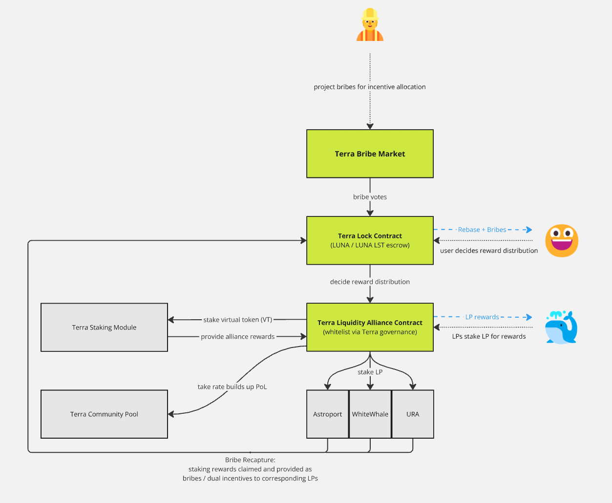"](image-1.png)
:::

## Glossary

| Abbreviation | Term                | Definition { class="compact" }                                                                                                                                                 |
| ------------ | ------------------- | ------------------------------------------------------------------------------------------------------------------------------------------------------------------------------ |
| LPs          | Liquidity Providers | LPs are users who provide funds to DEXes                                                                                                                                       |
| VP           | Voting Power        | VP is the amount of influence you have by locking up LUNA or LUNA LST into locks                                                                                               |
| LST          | Liquid Staked Token | Receipt token that can be used to redeem a liquid staking position. This token is accruing value through staking rewards.                                                      |
| z-asset      | z-asset             | The z-asset is the principle of a LST (e.g. zLUNA), it can be redeemed against the LST. Rewards are not being accrued but used for a specific purpose. In this case as rebase. |
| VT           | Virtual Token       | Token that is being created to stake in Alliance Module to receive rewards.                                                                                                    |
| Epoch        | Epoch               | Epoch is a week period starting from 12 pm UTC Sunday. It defines one round of reward distribution schedule, vote incentives and voting power                                  |

## Rewards

There are multiple different parts of the product where users and liquidity providers can get rewards for participation:

### 1. Liquidity incentives

Alliance staking rewards are converted and distributed as z-assets to liquidity providers. The distribution of the rewards is decided by voters per group of LPs. The liquidity incentives can be claimed on the liquidity tab.

### 2. Voting incentives

Each epoch, projects and users can add incentives, so that voters are incentivized to vote for the project's LPs.

### 3. Rebase

Rebase are additional rewards going to voters based on the underlying LUNA amount they locked. As liquidity incentives are distributed as z-assets, yield generated by these assets (via liquid staking)

## GUI

The GUI consists of 4 main tabs

### 1. Liquidity

Liquidity Tab is used for liquidity providers to see current rewards, deposit, withdraw and claim their liquidity incentives.

:::{.img-link .height-300}
[!ref target="blank" text="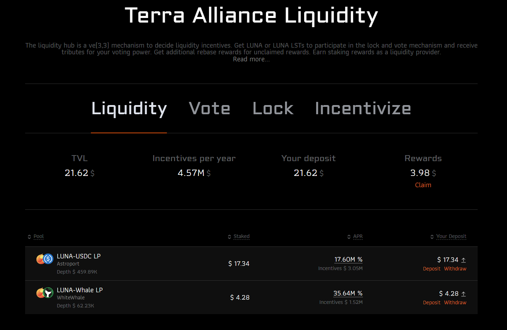"](image-3.png)
:::

Available actions:

- **Claim**: Users can claim accrued rewards in ampLUNA, bLUNA or LUNA

:::{.img-link .height-300}
[!ref target="blank" text="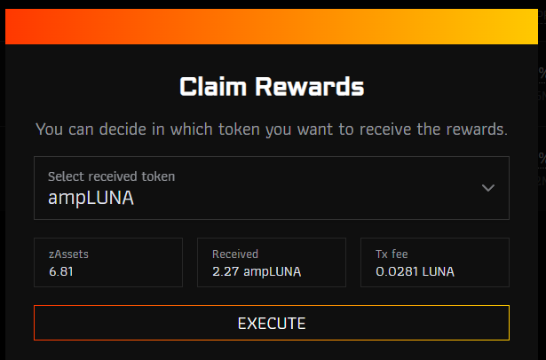"](image-4.png)
:::

- **Deposit**: Depositing / Staking an LP position can be done in four variants:
  - **Zap**: Use any supported token to "zap" into the LP, this will swap the tokens into the right ratio, create the LP and stake the LP in the Alliance Liquidity Hub.
  - **Tokens**: Use any of the LP pool tokens to create the LP.
  - **LP**: Stake already existing LPs
  - **Staked**: For Astroport LPs can be transferred directly, when they are staked in the Astroport incentive contract.

:::{.img-link .height-250}
[!ref target="blank" text="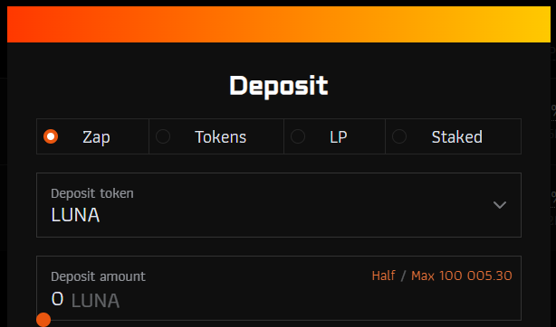"](image-6.png)
:::

- **Withdraw**: Withdrawing or unstaking an LP.
  - **Tokens**: Will withdraw the underlying tokens from the LP
  - **Zap**: Zap the underlying tokens to a selected output asset. Swaps will be executed.
  - **LP**: Just return LP tokens. This will allow transferring them to different wallets or staking it natively in each DEX.

:::{.img-link .height-300}
[!ref target="blank" text="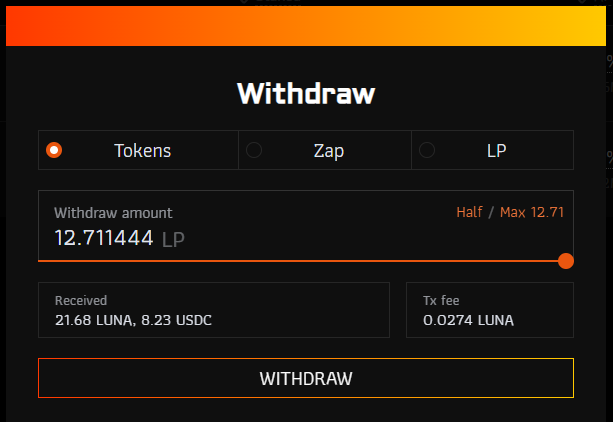"](image-10.png)
:::

### 2. Vote

The vote tab allows users to participate in the voting process. To participate locks are required first ([see lock](#3-lock)).

**vAPR** - Annualized rewards for current epoch. The value depends on your personal voting power factor. A lock time of the max 2 years will yield a factor of 10, while a 1 week lock only has a factor 1.

:::{.img-link .height-500}
[!ref target="blank" text="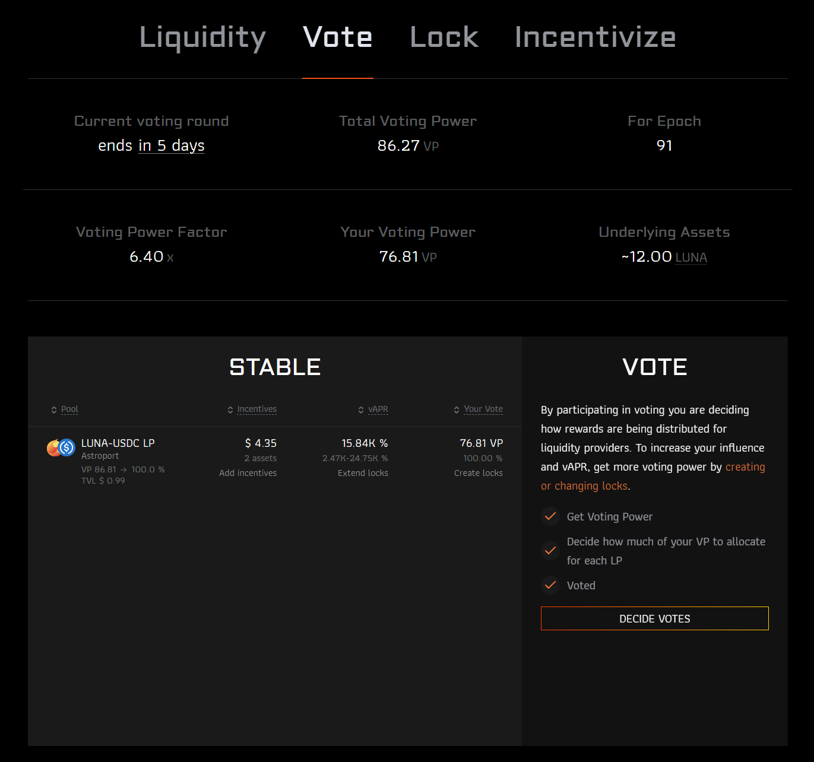"](image-18.png)
:::

- **Vote**: To participate in voting, for each asset group, votes need to be locked in, by pressing "decide votes" and distribute your voting power across all assets. Expected vAPR is being shown.

:::{.img-link .height-300}
[!ref target="blank" text="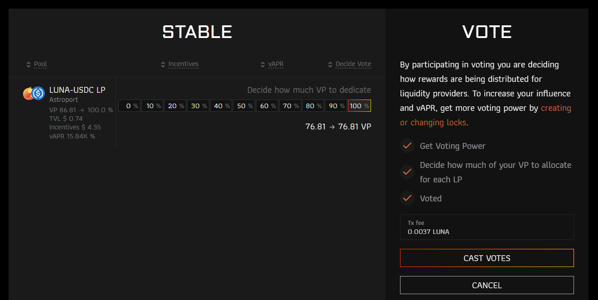"](image-14.png)
:::

- **Claim Rebase**: Rebases can be claimed
- **Claim Voting Incentives**: Vote incentives per period can be claimed

### 3. Lock

The lock tab is for creating and managing locks for the user. Locks are the source of voting power and required to participate in the voting process.

Locks are NFTs based on CW721 and therefore can be used as collateral,

:::{.img-link .height-500}
[!ref target="blank" text="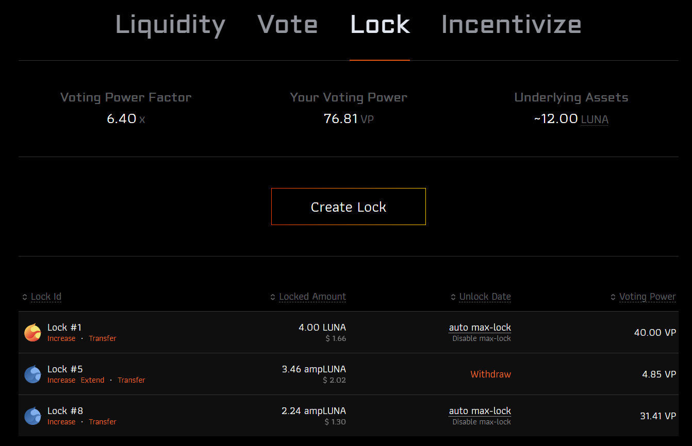"](image-15.png)
:::

Actions:

- **Create**: Creates a new lock
- **Withdraw**: If a lock has reached it's unlock date, the user can withdraw it.
- **Enable auto max-lock**: Converts a lock with a finit time, to an auto max-lock, therefore always keeping the VP at 10x of the underlying LUNA amount.
- **Disable auto max-lock**: Converts a lock with an auto max-lock, to a two year lock.
- **Increase**: Deposit additional assets into a specific lock
- **Extend**: Extend the lock time of a specific lock
- **Transfer**: Transfer a specific lock NFT to a different wallet. This user will get full ownership over the lock, including voting power and assets.
- **Merge**: Combines two locks, if locks have different end times, the shorter lock will be extended to the longer one before merging. Only locks with the same lock end can be merged.
- (**Split**): Not visible in GUI, but it is possible to split a lock into multiple locks with the same end time.

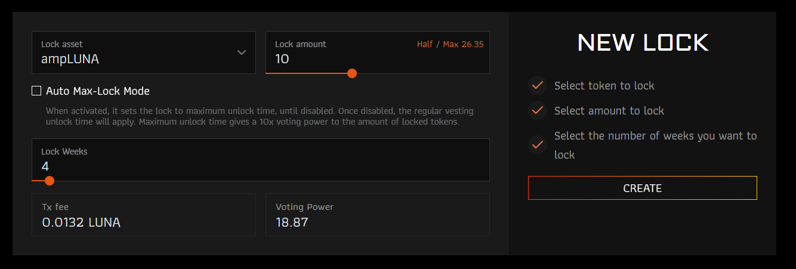

### 4. Incentivize

Incentivize tab allows projects to add incentives over a specified period of future epochs. This adds incentives for voters to vote in a desired way for the project to get liquidity.

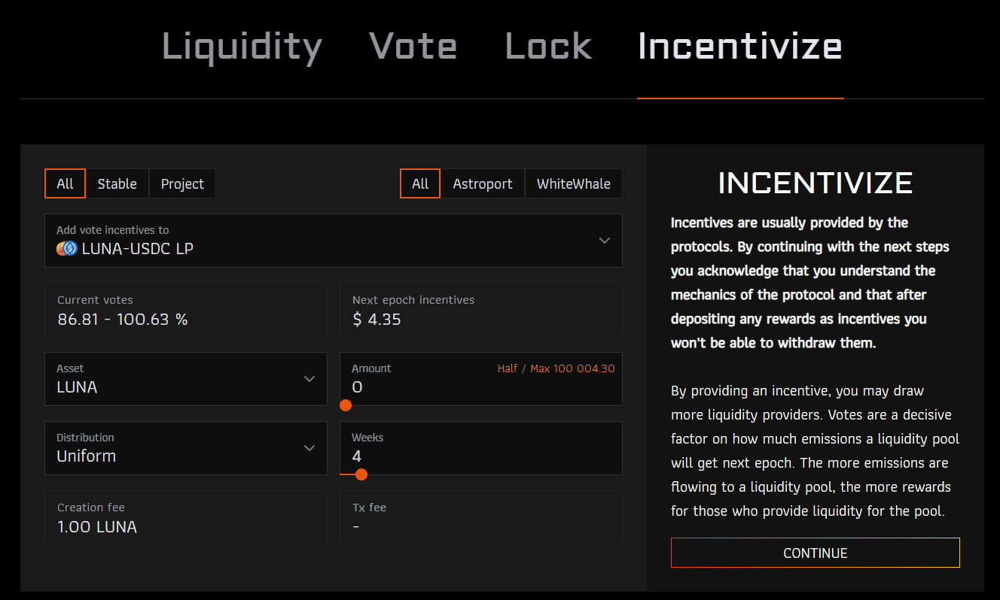

## Technical Details

:::{.img-link}
[!ref target="blank" text="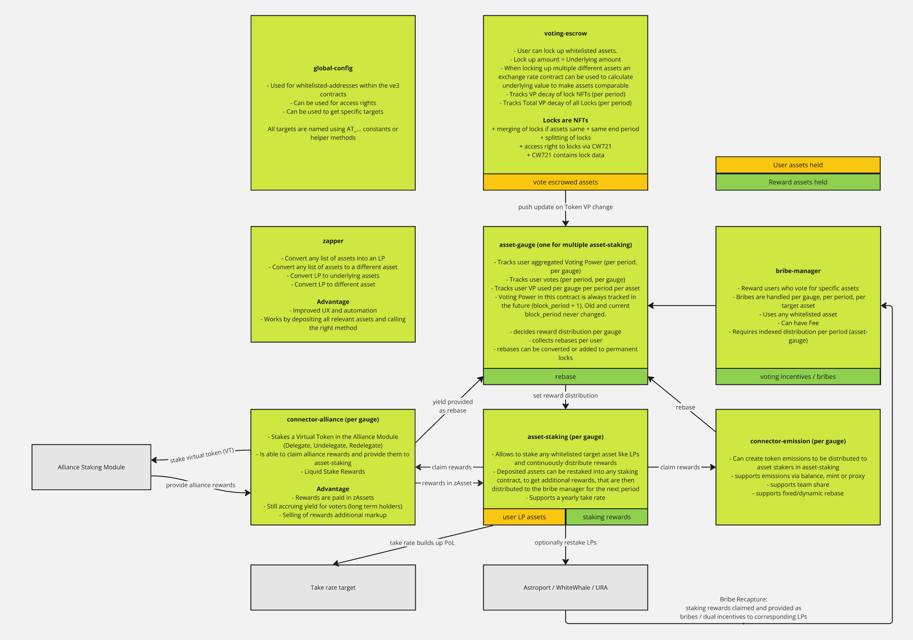"](image.png)
:::

### global-config

The global config contract is responsible for setting ownership of contracts and is an address type registry. It contains an owner who is allowed to call update methods on all contracts and the following specific rights can be setup.

| Right                      | Description { class="compact" }                                              |
| -------------------------- | ---------------------------------------------------------------------------- |
| DELEGATION_CONTROLLER      | Wallets that control connector-alliance delegations                          |
| ASSET_WHITELIST_CONTROLLER | Wallets that control whitelisted LPs in asset-staking                        |
| BRIBE_WHITELIST_CONTROLLER | Wallets that control whitelisted bribe assets in bribe-manager               |
| VE_GUARDIAN                | Wallets that can add or remove users from the voting escrow blacklist        |
| VOTING_ESCROW              | Contract address of Voting Escrow (used to check caller / call it)           |
| ASSET_GAUGE                | Contract address of the Asset Gauge (used to check caller / call it)         |
| BRIBE_MANAGER              | Contract address of the Bribe Manager (used to check caller / call it)       |
| FREE_BRIBES                | Wallets or contracts that can add bribes without paying a fee                |
| TAKE_RECIPIENT             | Wallet that receives LP take rate                                            |
| FEE_COLLECTOR              | Wallet that receives paid Bribe Fees                                         |
| TEAM_WALLET                | Wallet that receives token emissions from connector-emissions                |
| MINT_PROXY                 | Contract that is used if minting tokens via a proxy from connector-emissions |
| ASSET_STAKING\_\_\{gauge\} | Contract for asset-staking of a specified gauge                              |
| CONNECTOR\_\_\{gauge\}     | Contract for alliance-connector of a specified gauge                         |

### voting-escrow

Users lock up LUNA or LUNA LST to receive voting power. A user can have multiple locks with different lengths and supported assets. Voting-escrow is the manager of these locks, which are represented as NFTs, that can be transferred.

### asset-gauge

asset-gauge is the contract that is indexing the full voting power of a user per period, and how the user voted. Any change in a lock will also be reflected here for the voting power. It is responsible to set the reward distribution based on the voting result to the asset-staking contract.

Asset-gauge tracks rebases received based on the underlying amount of LUNA a user locked. Rebases are additional rewards for participating in the locking mechanism so that participation beats regular staking.

Note: Rebases depend on the underlying amount of locked LUNA (LST \* redemption rate) and not the Voting Power.

### asset-staking

asset-staking is tracking the staked LP assets per user and is responsible for distribution rewards set via the distribution schedule. Each group of tokens has their own assets.

Staked LP positions are being restaked to the underlying DEX if the DEX has staking rewards. The captured rewards are distributed as bribes in the next epoch.

### bribe-manager

bribe-manager is used for projects to add incentives for voters to vote in a certain way, e.g. incentivizing their own LPs. The bribes are not directly used for LP incentives and will only influence voter behavior. Bribes only goes to voters who vote for that LP in the corresponding period.

### connector-alliance

connector-alliance is a contract that creates a virtual token (VT), that is then being staked in Alliance Module. Rewards captured through this staking will then be claimed, and distributed as z-assets to asset-staking.

Staking rewards are not directly distributed as LUNA, but instead liquid staked and so-called z-assets are being distributed to LP stakers. Z-assets (zLUNA) is an interal accounting mechanism to split the tokens into yield and principle of an LSTs. Principle is distributed to LPs as liquidity incentives, while yield is distributed to voters as rebase.

Using z-assets as LP rewards has these major benefits:

- Vote participants will receive rebases based on liquidity incentives held by asset-staking. While these z-asset rewards are owned and claimable by liquidity providers, they still generate passive revenue, which is being redirected to voters, therefore making active participation in the gauges more profitable than regular staking. This leads to real incentives to participate in the voting mechanism from the start
- Rewards are productively used to create more incentives for voters (more capital efficient)
- Users will be able to withdraw the rewards in ampLUNA (direct) or bLUNA (swap) or LUNA (swap), z-asset (zLUNA) is only an internal accounting mechanism.
- Market sellers will need to pay markup to exit LST -> long term holders are incentivized
- Increased economic activity: Through increased trading activity, LST LPs will receive more trading activity and Arb Vaults increase economic activity (long term LUNA holders)

### connector-emissions

connector-emissions, allows a similar mechanism with the difference, that instead of Alliance Module, a regular token minting process can be used. This is not applied in the Terra Liquidity Alliance, but can be used by projects like URA DEX.

### zapper

Zapper is a refactoring from the Amp Compounder Zapper, with improved routing and functionality.

- It allows converting any list of supported assets into an LP.
- It allows converting an LP into the underlying assets
- It allows converting an LP into any supported asset
- It allows swapping any list of supported assets into another supported asset

Paths can include any contract or DEX, but are fixed based on the liquidity depth and trying to find the shortest path between two assets. It is not replacing a DEX aggregator, but it will allow simple zapping methods for improved UX.
