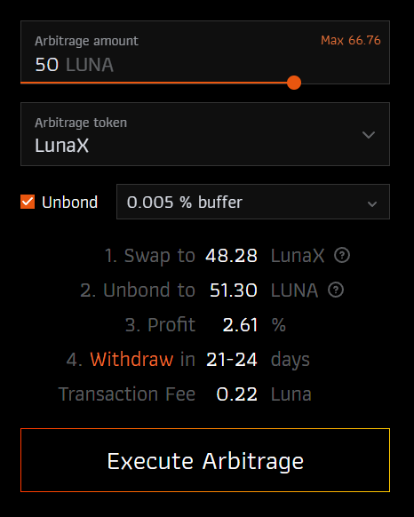

# Manual Arb

Manual Arb allows you to check if there are arbitrage opportunities on the corresponding chain.
It will convert the inputed [TOKEN/COIN] into a liquid staking derivative (LSD) token and checks if the returned amount is higher than the initially inputed amount.

While this is our manual slow-burn arbitrage GUI, we are working on releasing a fully automated arbitrage protocol. For the details see [Arb Repeater](../arb-repeater/). It will work similiar to the manual arbitrage tool, but have a model on how and when slow-burn arbitrages are being executed.

- Terra: https://www.erisprotocol.com/terra/manual-arbitrage

## GUI

### Input

- **Arbitrage amount**: Amount of funds you want to use for the Arbitrage.
- **Arbitrage token**: Specify the token that the arbitrage is being checked for.
- **Unbond**: Specify whether the resulting LSD should be unbonded immediately.
- **Buffer**: Specify the buffer for the unbonding. As we do not use any contract for the composition of transaction messages, the transaction may fail when someone else is swapping at the same time. To reduce the risk of failed transactions, we keep a buffer. If you hold some LSD you are trading in your wallet you can keep it on "unbond everything". We directly start unbonding in the same transaction and you can claim the result after x days on the corresponding withdraw page of the LSD.

### Output

- **1. Swap**: Estimation of how many tokens of the LSD you will receive
- **2. Unbond**: Calculation of the amount you received times the current exchange rate of the LSD when executing slow burn unbonding.
- **3. Profit / Loss**: Shows if your overall swap will be profitable or not. This contains already protocol fees, but not the transaction fee.
- **4. Withdraw**: Reminder if you use automatic unbonding, that you will need to withdraw your funds after x days on the corresponding withdraw page.
- **Transaction Fee**: Simulated transaction fee for the arbitrage.

## Swap Routing

For finding the best swap route between [TOKEN] and LSD we are using [TFM](www.tfm.com).

## Fees

For our own amp[TOKEN] we will not charge any fees for product usage.
For external LSD-tokens we charge a flat fee of 0.5 % payed to our treasury to support our development.
