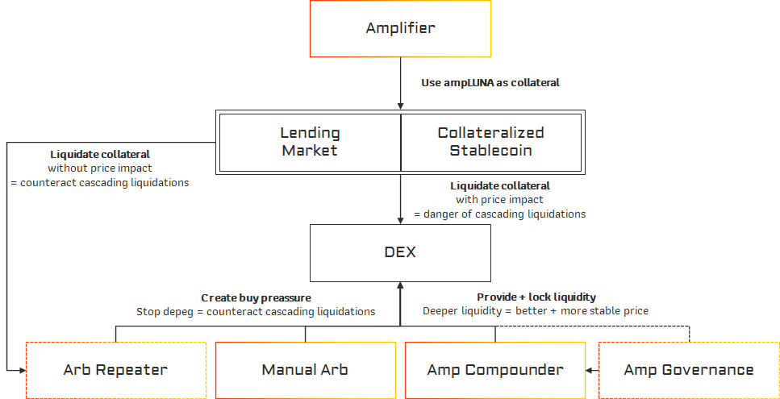
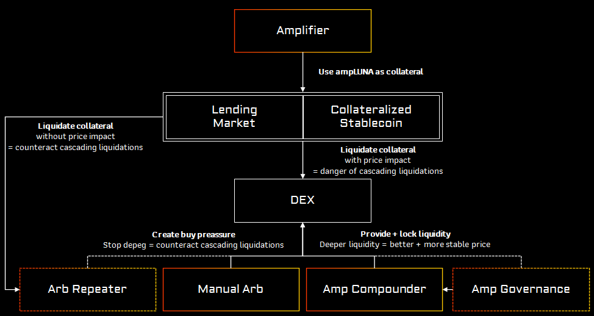
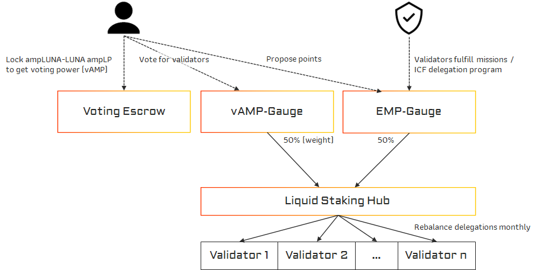
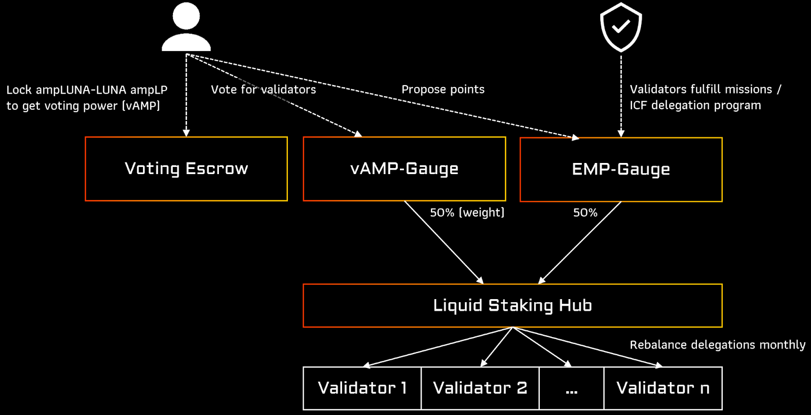
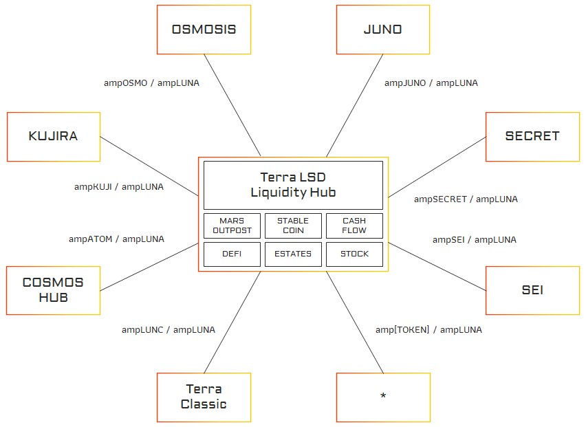
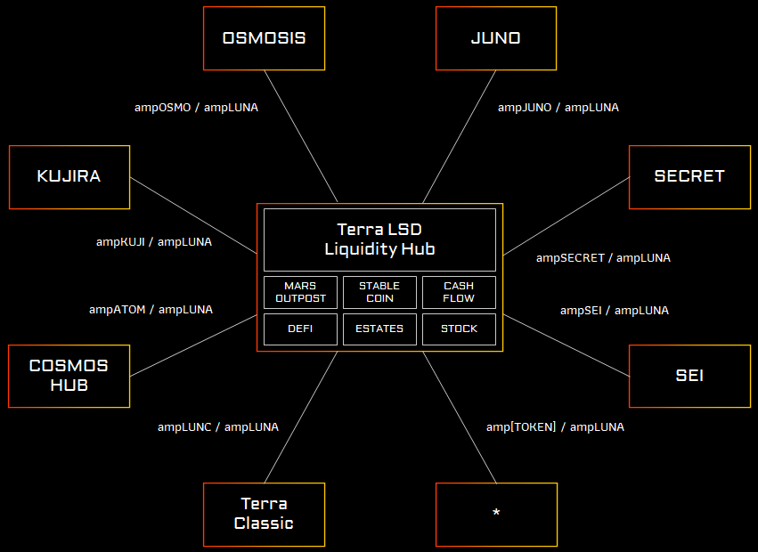

# Vision

ERIS Protocol's goal is to provide the best LSD economy while also providing the best APY, community focus and advanced tech. ERIS is an innovative vault management platform geared towards stability and sustainability.

## Stable LSD economy

For the usage and risks of Liquid Staking Derivatives it is essential to provide a stable LSD economy. LSD’s can have the issue of leading to cascading liquidation, even though the price of the underlying asset has not changed. We provide the tools and products to support a stable economy of LSD’s.

:::white

:::
:::black

:::

See our products documentation for details.

## Fair delegations

When providing coins to a LSD-protocol the depositor gives away his delegation and governance power to the protocol. It leads to possible validator cartels or giving the power to a different governance token. It is time for the LSD protocols to give this power back to the user and enable a fair delegation and governance framework.

:::white

:::
:::black

:::

See [Amp Governance](./../products/amp-governance)

## LSD liquidity hub

We believe that having concentrated liquidity for all liquid staking coins in the cosmos universe brings a big advantage to the Terra ecosystem.

Having native liquidity on one cosmos DEFI chain brings many integration benefits for other products. Instead of introducing asynchronous complexities, dApps can seamlessly integrate with any yield generating token.

Any amp[TOKEN] from any cosmos based chain can then be used on Terra.

:::white

:::

:::black

:::

## KISS - Keep it simple, stupid

While there are many protocols going for the App Chain approach, which also has their use cases, we are explicitly going for a DeFi Chain. 

Our home base will be Terra, but with IBC (ICS20, ICS27, ICS31) we can still connect to any IBC supporting blockchain. This allows us to rebuild the DeFi System that once flourished on Terra.

## RealYield - No BS

No platform token. 

By holding amp[TOKEN] you will receive part of the performance fees collected by Eris Protocol on the corresponding blockchain. So all our launched products on the Terra Network will provide performance fees to ampLUNA holders.

## ERIS advantages

- Best APY
  - Low fees (5 %) + revenue sharing
  - The LSD APY is boosted by sharing 50 % of our other products' revenue
- Community based
  - Only self-funded and by the Terra community pool
- Sharing 10% revenue with Terra Community Pool
- Innovative Governance and Delegation Process
- Providing best LSD stability
